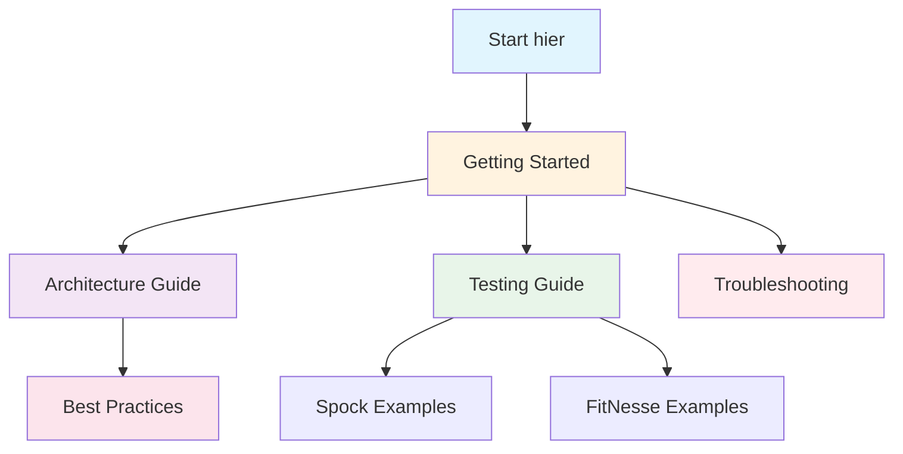

# 📚 Dokumentations-Übersicht

Willkommen zur Dokumentation des FitNesse & Spock Test-Framework Tutorials!

## 🗺️ Navigation

## 📖 Dokumentations-Struktur

### 🎯 **[Getting Started](getting-started.md)**
*Beginne hier wenn du neu im Projekt bist*
- Installation & Setup
- Erste Tests ausführen
- Projekt-Struktur verstehen
- Quick Start Guide

### 🏗️ **[Architecture Guide](architecture.md)**
*Verstehe wie alles zusammenarbeitet*
- System-Architektur mit Diagrammen
- Komponenten-Übersicht
- Datenflüsse
- Spring Boot Integration

### 🧪 **[Testing Guide](testing-guide.md)**
*Lerne beide Test-Frameworks kennen*
- Spock Framework Grundlagen
- FitNesse Wiki & Fixtures
- Framework-Integration
- Test-Strategien

### 📝 **Beispiele & Tutorials**
- **[Spock Test Examples](examples/spock-tests.md)** - Praktische Spock-Beispiele
- **[FitNesse Fixtures](examples/fitnesse-fixtures.md)** - Über 10 Fixture-Typen

### ⭐ **[Best Practices](best-practices.md)**
*Professionelle Patterns und Empfehlungen*
- Code-Organisation
- Test-Design
- CI/CD Integration
- Performance-Tipps

### 🔧 **[Troubleshooting](troubleshooting.md)**
*Wenn etwas nicht funktioniert*
- Häufige Probleme
- Lösungsansätze
- Debug-Strategien
- FAQ

## 🚀 Schnellzugriff nach Aufgabe

### "Ich möchte..."

#### ...das Projekt zum Laufen bringen
→ [Getting Started](getting-started.md) > Installation

#### ...einen neuen Spock Test schreiben
→ [Spock Examples](examples/spock-tests.md) > Unit Tests

#### ...einen FitNesse Test erstellen
→ [Testing Guide](testing-guide.md) > FitNesse Framework

#### ...eine neue Fixture implementieren
→ [FitNesse Fixtures](examples/fitnesse-fixtures.md)

#### ...verstehen wie die Services funktionieren
→ [Architecture Guide](architecture.md) > Spring Boot Application

#### ...ein Problem lösen
→ [Troubleshooting](troubleshooting.md)

## 📊 Test-Framework Vergleich

| Aspekt | Spock | FitNesse |
|--------|-------|----------|
| **Primäre Nutzer** | Entwickler | Business & Entwickler |
| **Test-Sprache** | Groovy Code | Wiki-Tabellen |
| **Test-Ebene** | Unit, Integration | Acceptance, E2E |
| **Ausführung** | IDE, CLI, CI/CD | Browser, CLI |
| **Geschwindigkeit** | Sehr schnell | Mittel |
| **Lernkurve** | Mittel | Niedrig-Mittel |

## 🔗 Externe Ressourcen

- [Spock Framework Official Docs](https://spockframework.org/)
- [FitNesse User Guide](http://fitnesse.org/)
- [Spring Boot Testing](https://spring.io/guides/gs/testing-web/)
- [Groovy Documentation](https://groovy-lang.org/documentation.html)

## 💡 Tipps für Einsteiger

1. **Starte mit Getting Started** - Nicht überspringen!
2. **Führe existierende Tests aus** bevor du neue schreibst
3. **Verstehe die Architektur** für besseres Debugging
4. **Nutze die Beispiele** als Vorlage für eigene Tests
5. **Bei Problemen** → Troubleshooting Guide

---

*Diese Dokumentation wird kontinuierlich verbessert. Feedback willkommen!*