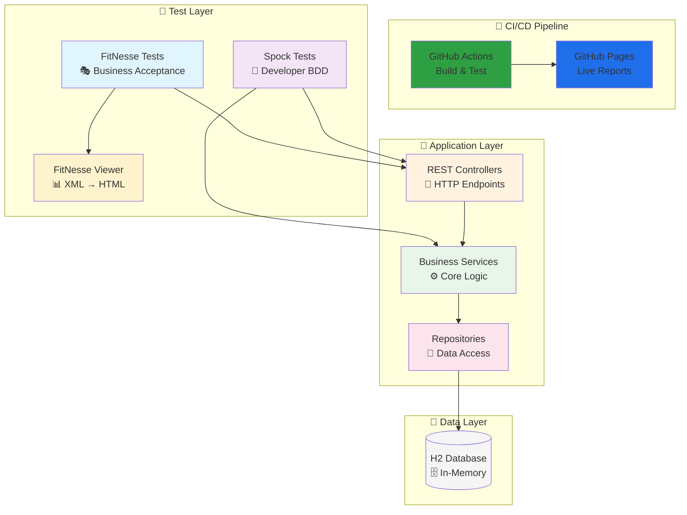
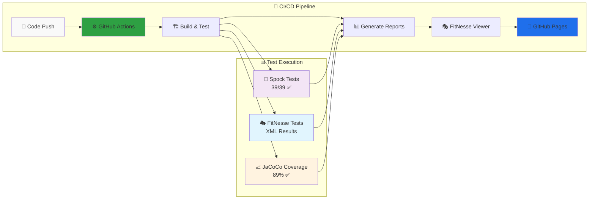
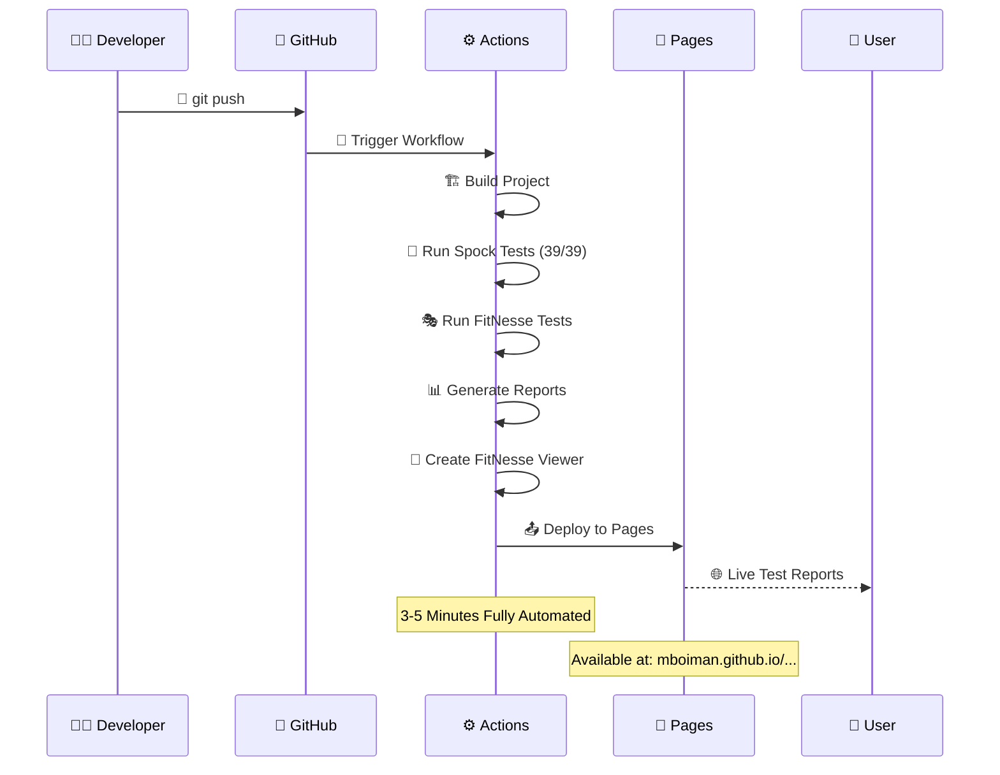
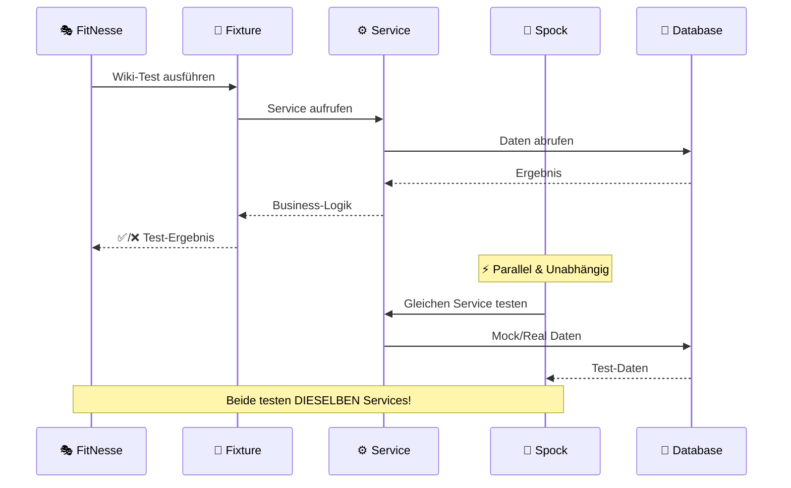
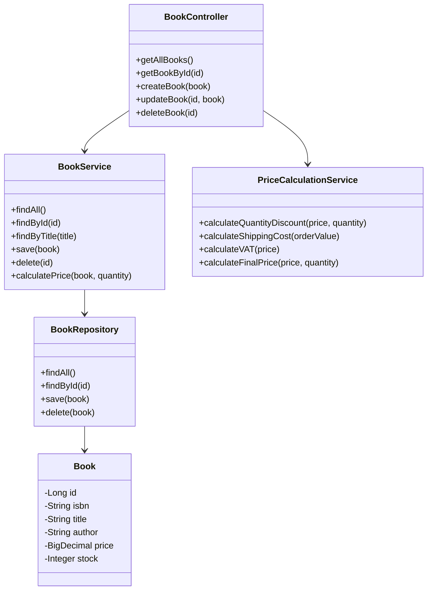
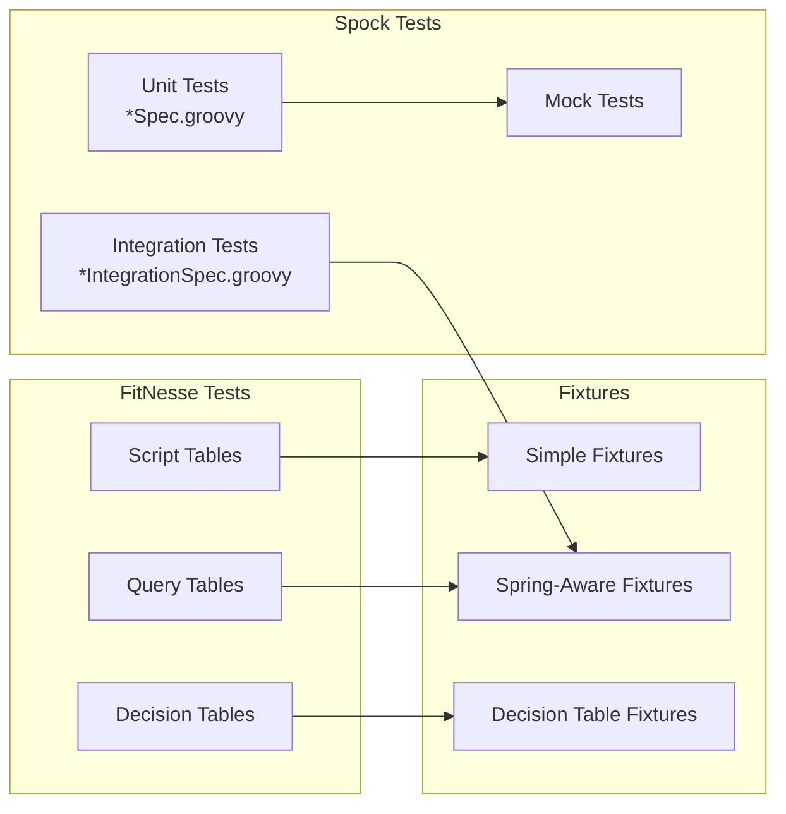
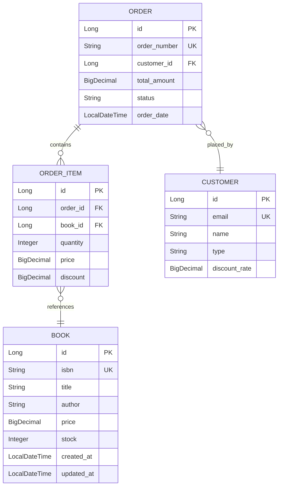
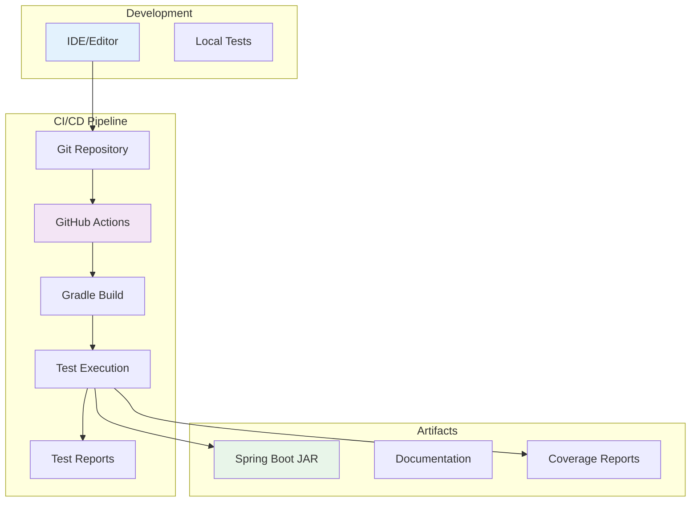

# Architecture Guide 🏗️

**Verstehen Sie das moderne Test-Framework Design mit CI/CD und Live-Reports**

Dieses Dokument erklärt die Architektur der **FitNesse-Spock Tutorial-Anwendung** mit Fokus auf professionelle Test-Integration und automatisierte Deployment-Pipeline.

## 🎯 System-Überblick

Ein **Dual-Framework Test-System** mit automatischer CI/CD Pipeline und GitHub Pages Integration:



## 🔄 Test-Framework Integration

### ⚠️ Wichtige Architektur-Klarstellung

**FitNesse und Spock sind vollständig voneinander getrennte Test-Frameworks:**

- ❌ **KEINE Verbindung**: FitNesse Fixtures rufen niemals Spock Tests auf
- ✅ **Unabhängige Ausführung**: Beide Frameworks laufen separat und parallel
- 🔄 **Gemeinsame Services**: Beide testen dieselben Spring Services, aber unterschiedlich
- 📊 **Separate Reports**: Jedes Framework generiert eigene Test-Ergebnisse

```
📊 Test-Pyramid Architektur:
┌─────────────────────────────────┐
│        🎭 FitNesse              │ ← Business Acceptance Tests
│     (Stakeholder Tests)         │   
├─────────────────────────────────┤
│        🔬 Spock Integration     │ ← API & Service Integration  
├─────────────────────────────────┤
│        🔬 Spock Unit Tests      │ ← Logic & Component Tests
└─────────────────────────────────┘
           ⬇️ Both test ⬇️
        📱 Spring Boot Services
```

Diese Trennung ist bewusstes Design und folgt der Test-Pyramide:
- **Spock**: Unit/Integration Tests (Basis der Pyramide) - viele schnelle Tests
- **FitNesse**: Acceptance Tests (Spitze der Pyramide) - wenige umfassende Tests

## 🚀 CI/CD Pipeline Architektur

### GitHub Actions Workflow



### 🔧 Pipeline Komponenten

| Komponente | Funktion | Output | Live URL |
|------------|----------|--------|----------|
| **GitHub Actions** | Automatische Builds | CI/CD Status | [Actions Tab](https://github.com/mboiman/fitnesse-spock-tutorial/actions) |
| **Spock Tests** | Unit/Integration Tests | HTML Reports | [📊 Spock Reports](https://mboiman.github.io/fitnesse-spock-tutorial/build/reports/tests/test/index.html) |
| **FitNesse Tests** | Acceptance Tests | XML → HTML Viewer | [🎭 FitNesse Results](https://mboiman.github.io/fitnesse-spock-tutorial/fitnesse-results.html) |
| **JaCoCo Coverage** | Code Coverage Analysis | Coverage Reports | [📈 Coverage Report](https://mboiman.github.io/fitnesse-spock-tutorial/build/reports/jacoco/test/html/index.html) |
| **GitHub Pages** | Static Site Hosting | Live Dashboard | [🌐 Live Demo](https://mboiman.github.io/fitnesse-spock-tutorial/) |

### 🎭 FitNesse Viewer Innovation

**Problem**: FitNesse generiert XML-Dateien, die im Browser nicht schön aussehen.

**Lösung**: Custom JavaScript-basierter XML-Viewer:

```
FitNesse XML Results → JavaScript Parser → Beautiful HTML Display
├── Test Statistics (Right/Wrong/Ignored/Exceptions)
├── Color-coded Status (✅ Pass / ❌ Fail)
├── Timestamp Information
└── Formatted Test Tables
```

**Features**:
- 📊 **Visual Test Statistics** mit Badges
- ✅ **Pass/Fail Indicators** für schnelle Übersicht  
- 📅 **Timestamp Parsing** aus Dateinamen
- 🎨 **Responsive Design** für alle Geräte
- 📱 **Mobile-friendly** Interface

## 🔄 Workflow Automation

### Deployment Pipeline



### Datenfluss zwischen Frameworks



## 📦 Komponenten-Architektur

### Spring Boot Application



### Test-Architektur



## 🗂️ Package-Struktur

### Hauptanwendung

```
de.tutorial.bookstore/
├── BookstoreApplication.java      # Spring Boot Main
├── controller/
│   ├── BookController.java       # REST Endpoints
│   └── OrderController.java      # Order Management
├── service/
│   ├── BookService.java         # Book Business Logic
│   ├── OrderService.java        # Order Processing
│   └── PriceCalculationService.java # Pricing Rules
├── repository/
│   ├── BookRepository.java      # Book Data Access
│   └── OrderRepository.java     # Order Data Access
└── model/
    ├── Book.java               # Book Entity
    ├── Order.java              # Order Entity
    └── OrderItem.java          # Order Line Items
```

### Test-Struktur

```
test/
├── groovy/de/tutorial/bookstore/
│   ├── service/
│   │   ├── BookServiceSpec.groovy
│   │   ├── PriceCalculationServiceSpec.groovy
│   │   └── OrderServiceSpec.groovy
│   ├── controller/
│   │   └── BookControllerIntegrationSpec.groovy
│   └── e2e/
│       └── BookstoreE2ESpec.groovy
│
├── java/de/tutorial/fixtures/
│   ├── SimpleCalculator.java
│   ├── BookSearchFixture.java
│   ├── PriceCalculationDecisionTable.java
│   └── SpringAwarePriceCalculationFixture.java
│
└── fitnesse/FitNesseRoot/
    ├── BookstoreTests/
    │   ├── SimpleCalculatorTest/
    │   ├── PriceCalculations/
    │   └── ShippingCosts/
    └── FixtureGallery/
```

## 💾 Datenmodell



## 🔧 Konfiguration

### Spring Profiles

```yaml
# application.yml
spring:
  profiles:
    active: ${SPRING_PROFILES_ACTIVE:dev}

---
# Development Profile
spring:
  config:
    activate:
      on-profile: dev
  h2:
    console:
      enabled: true
  datasource:
    url: jdbc:h2:mem:devdb

---
# Test Profile
spring:
  config:
    activate:
      on-profile: test
  datasource:
    url: jdbc:h2:mem:testdb;DB_CLOSE_DELAY=-1
```

### Build-Konfiguration

```groovy
// build.gradle - Wichtige Konfigurationen
test {
    useJUnitPlatform()
    maxParallelForks = Runtime.runtime.availableProcessors()
}

fitnesse {
    port = 9090
    root = 'src/test/fitnesse'
    workingDir = 'build/fitnesse'
}
```

## 🚀 Deployment-Architektur



## 🔐 Sicherheitsaspekte

1. **Keine Produktionsdaten** in Tests
2. **In-Memory H2** für Isolation
3. **Separate Test-Profile** 
4. **Keine Credentials** im Code

## 📈 Performance-Überlegungen

- **Parallele Test-Ausführung** für Spock
- **Lazy Loading** in Spring Services
- **Connection Pooling** mit HikariCP
- **Test-Daten-Isolation** pro Test

## 🔗 Weiterführende Links

- [Testing Guide](testing-guide.md) - Details zu Test-Strategien
- [Best Practices](best-practices.md) - Architektur-Patterns
- [Spring Boot Docs](https://spring.io/projects/spring-boot)
- [Spock Framework](https://spockframework.org/)
- [FitNesse Wiki](http://fitnesse.org/)