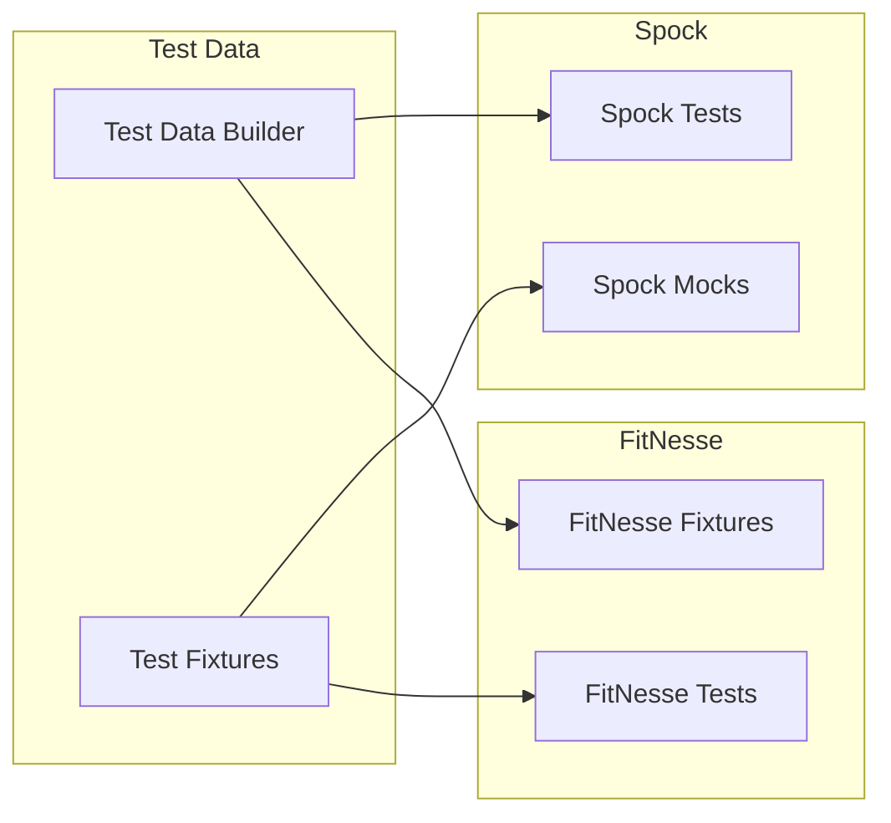
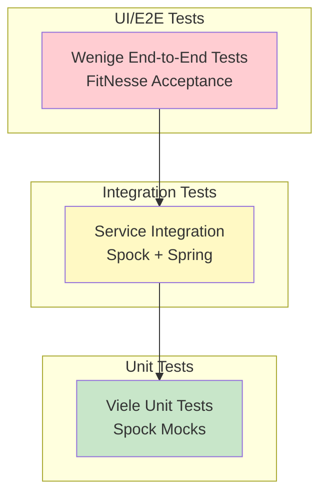

# Testing Guide 🧪

Umfassende Anleitung für das Testen mit Spock und FitNesse.

## 📑 Inhaltsverzeichnis

1. [Spock Framework](#spock-framework)
   - [Grundlagen](#spock-grundlagen)
   - [Test-Struktur](#spock-test-struktur)
   - [Mocking & Stubbing](#mocking--stubbing)
   - [Data-Driven Tests](#data-driven-tests)
2. [FitNesse Framework](#fitnesse-framework)
   - [Grundlagen](#fitnesse-grundlagen)
   - [Wiki-Syntax](#wiki-syntax)
   - [Table-Typen](#table-typen)
   - [Fixtures schreiben](#fixtures-schreiben)
3. [Framework-Integration](#framework-integration)
4. [Test-Strategien](#test-strategien)

---

## Spock Framework

### Spock Grundlagen

Spock ist ein BDD (Behavior-Driven Development) Test-Framework für Java und Groovy Anwendungen.

```groovy
// Basis-Struktur eines Spock Tests
class MeinServiceSpec extends Specification {
    
    def "Beschreibung was getestet wird"() {
        given: "Vorbedingungen"
        // Setup Code
        
        when: "Aktion ausgeführt wird"
        // Ausführung
        
        then: "Erwartetes Ergebnis"
        // Assertions
    }
}
```

### Spock Test-Struktur

#### 1. Feature Methods (Test-Methoden)

```groovy
class BookServiceSpec extends Specification {
    
    def bookService = new BookService()
    
    def "sollte alle Bücher zurückgeben"() {
        when: "alle Bücher abgefragt werden"
        def books = bookService.findAll()
        
        then: "wird eine nicht-leere Liste zurückgegeben"
        books != null
        !books.isEmpty()
    }
    
    def "sollte Exception werfen bei ungültiger ISBN"() {
        when: "ungültige ISBN verwendet wird"
        bookService.findByIsbn("invalid")
        
        then: "wird IllegalArgumentException geworfen"
        thrown(IllegalArgumentException)
    }
}
```

#### 2. Setup und Cleanup

```groovy
class DatabaseIntegrationSpec extends Specification {
    
    def dataSource
    
    def setupSpec() {
        // Einmal vor allen Tests
        dataSource = createTestDataSource()
    }
    
    def setup() {
        // Vor jedem Test
        cleanDatabase()
    }
    
    def cleanup() {
        // Nach jedem Test
        rollbackTransaction()
    }
    
    def cleanupSpec() {
        // Einmal nach allen Tests
        dataSource.close()
    }
}
```

### Mocking & Stubbing

```groovy
class OrderServiceSpec extends Specification {
    
    def bookRepository = Mock(BookRepository)
    def emailService = Mock(EmailService)
    def orderService = new OrderService(bookRepository, emailService)
    
    def "sollte Bestellung verarbeiten und Email senden"() {
        given: "ein verfügbares Buch"
        def book = new Book(id: 1, title: "Test Book", stock: 10)
        bookRepository.findById(1) >> book
        
        when: "Bestellung aufgegeben wird"
        def order = orderService.placeOrder(1, 2, "test@example.com")
        
        then: "wird Lagerbestand aktualisiert"
        1 * bookRepository.save({ it.stock == 8 })
        
        and: "wird Bestätigungs-Email gesendet"
        1 * emailService.sendOrderConfirmation("test@example.com", _)
        
        and: "wird Bestellnummer zurückgegeben"
        order.orderNumber =~ /ORD-\d{8}/
    }
}
```

### Data-Driven Tests

```groovy
class PriceCalculationSpec extends Specification {
    
    @Unroll
    def "Mengenrabatt für #quantity Bücher sollte #expectedDiscount% sein"() {
        given:
        def calculator = new PriceCalculator()
        
        expect:
        calculator.getDiscountRate(quantity) == expectedDiscount
        
        where:
        quantity | expectedDiscount
        1        | 0
        2        | 0
        3        | 5
        5        | 10
        10       | 15
        20       | 20
    }
    
    @Unroll
    def "Versandkosten für Bestellwert #orderValue sollten #shippingCost EUR sein"() {
        expect:
        new ShippingCalculator().calculate(orderValue) == shippingCost
        
        where:
        orderValue || shippingCost
        15.00      || 4.95
        35.00      || 2.95
        50.00      || 0.00
        100.00     || 0.00
    }
}
```

## FitNesse Framework

### FitNesse Grundlagen

FitNesse ist ein Wiki-basiertes Acceptance Testing Framework, das es Business-Stakeholdern ermöglicht, Tests zu schreiben.

### Wiki-Syntax

```wiki
!1 Test-Seite Überschrift
!2 Unterüberschrift

!define TEST_SYSTEM {slim}
!path /pfad/zu/fixtures

Normaler Text mit **fett** und ''kursiv''.

|Tabelle Header 1|Header 2|
|Wert 1|Wert 2|
|Wert 3|Wert 4|

!include .SetUp
!see AlsoThisPage
```

### Table-Typen

#### 1. Decision Table

```wiki
!|de.tutorial.fixtures.PriceCalculator|
|buchpreis|anzahl|rabatt?|endpreis?|
|29.99|1|0.00|29.99|
|29.99|3|5.00|85.47|
|29.99|5|10.00|134.96|
|29.99|10|15.00|254.92|
```

Fixture dazu:
```java
public class PriceCalculator {
    private double buchpreis;
    private int anzahl;
    
    public void setBuchpreis(double preis) {
        this.buchpreis = preis;
    }
    
    public void setAnzahl(int anzahl) {
        this.anzahl = anzahl;
    }
    
    public String rabatt() {
        // Berechne Rabatt
        return String.format("%.2f", calculateDiscount());
    }
    
    public String endpreis() {
        // Berechne Endpreis
        return String.format("%.2f", calculateFinalPrice());
    }
}
```

#### 2. Script Table

```wiki
!|script|de.tutorial.fixtures.BookstoreScript|
|ich melde mich an als|admin@bookstore.de|
|ich suche nach|Java|
|check|anzahl gefundene bücher|5|
|ich wähle buch nummer|1|
|ich lege das buch in den warenkorb|
|check|artikel im warenkorb|1|
|ich gehe zur kasse|
|check|bestellung erfolgreich|true|
```

#### 3. Query Table

```wiki
!|Query:de.tutorial.fixtures.BookQuery|
|isbn|title|author|price|
|978-3-16-148410-0|Clean Code|Robert Martin|39.95|
|978-0-13-235088-4|Refactoring|Martin Fowler|45.50|
```

### Fixtures schreiben

#### Best Practices für Fixtures

```java
public class BookSearchFixture {
    private BookService bookService;
    
    public BookSearchFixture() {
        // Spring Context oder Service initialisieren
        ApplicationContext context = getApplicationContext();
        this.bookService = context.getBean(BookService.class);
    }
    
    // Für Decision Tables
    private String searchTerm;
    
    public void setSearchTerm(String term) {
        this.searchTerm = term;
    }
    
    public int bookCount() {
        return bookService.searchBooks(searchTerm).size();
    }
    
    // Für Script Tables
    public boolean searchForBook(String title) {
        List<Book> results = bookService.searchBooks(title);
        return !results.isEmpty();
    }
    
    public String firstBookTitle() {
        return currentSearchResults.get(0).getTitle();
    }
}
```

## Framework-Integration

### Gemeinsame Services nutzen

```groovy
// Spock Test
class PriceServiceSpec extends Specification {
    @Autowired
    PriceCalculationService priceService
    
    def "testet Preisberechnung"() {
        expect:
        priceService.calculateFinalPrice(100, 5) == 450.00
    }
}
```

```java
// FitNesse Fixture
public class PriceFixture {
    private PriceCalculationService priceService;
    
    public PriceFixture() {
        this.priceService = SpringContext.getBean(PriceCalculationService.class);
    }
    
    public double calculatePrice(double price, int quantity) {
        return priceService.calculateFinalPrice(price, quantity);
    }
}
```

### Test-Daten Synchronisation



## Test-Strategien

### Test-Pyramide



### Wann welches Framework?

| Kriterium | Spock | FitNesse |
|-----------|-------|----------|
| **Zielgruppe** | Entwickler | Business + Entwickler |
| **Test-Ebene** | Unit, Integration | Acceptance, E2E |
| **Geschwindigkeit** | Sehr schnell | Mittel |
| **Wartbarkeit** | Hoch (Code) | Mittel (Wiki) |
| **Dokumentation** | Code-Kommentare | Wiki-Seiten |
| **CI/CD Integration** | Exzellent | Gut |
| **Verbindung** | Keine - testet Services direkt | Keine - Fixtures testen Services direkt |

#### ⚠️ Wichtiger Hinweis

**FitNesse und Spock sind komplett getrennt:**
- FitNesse Fixtures rufen **NICHT** Spock Tests auf
- Beide Frameworks testen unabhängig dieselben Spring Services
- Fixtures sind Java-Klassen, die Services direkt instantiieren
- Dies ist bewusstes Design gemäß Test-Pyramide

### Test-Organisation

```
tests/
├── unit/           # Spock - Schnelle, isolierte Tests
├── integration/    # Spock - Service-Integration  
├── api/           # Spock - REST API Tests
├── acceptance/    # FitNesse - Business Rules
└── e2e/          # FitNesse - User Journeys
```

## 🎯 Best Practices

### Spock Best Practices

1. **Aussagekräftige Methodennamen**: Nutze Strings für Beschreibungen
2. **Given-When-Then**: Folge immer der BDD-Struktur
3. **@Unroll**: Nutze für Data-Driven Tests
4. **Mocks sparsam**: Nur externe Dependencies mocken
5. **Shared Resources**: Nutze @Shared für teure Ressourcen

### FitNesse Best Practices

1. **Thin Fixtures**: Keine Business-Logik in Fixtures
2. **Klare Tabellen**: Selbsterklärende Spaltennamen
3. **SetUp/TearDown**: Nutze für Test-Isolation
4. **Variablen**: Definiere wiederkehrende Werte
5. **Includes**: Nutze für gemeinsame Test-Schritte

## 📚 Weiterführende Ressourcen

- [Spock Framework Dokumentation](https://spockframework.org/spock/docs/)
- [FitNesse User Guide](http://fitnesse.org/FitNesse.UserGuide)
- [Beispiel-Tests](examples/) in diesem Projekt
- [Best Practices Guide](best-practices.md)