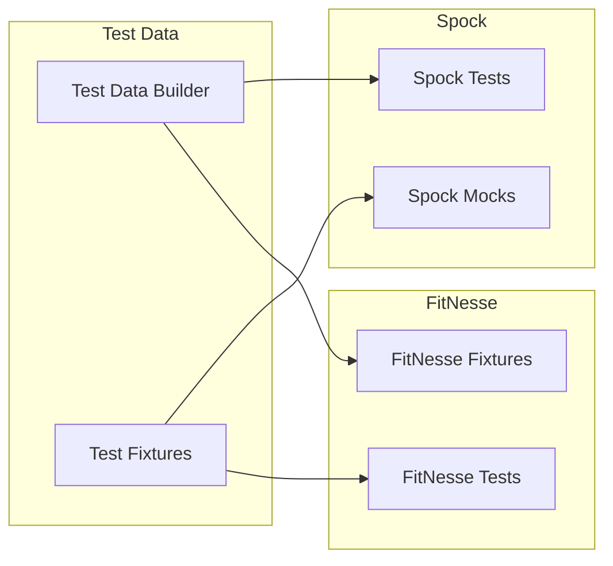
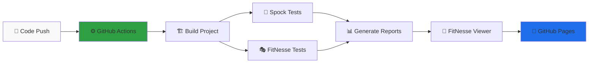
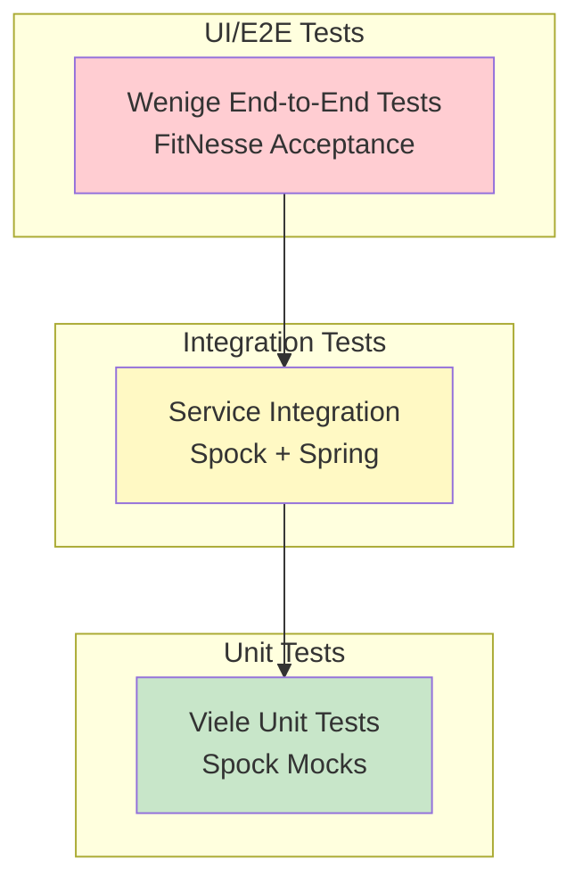

# Testing Guide 🧪

**Meistern Sie moderne Test-Frameworks mit Live-Reports und CI/CD Integration**

Umfassende Anleitung für professionelles Testen mit **Spock** und **FitNesse** inklusive GitHub Pages Deployment.

## 🎯 Was Sie lernen

- ✅ **Spock BDD Tests** schreiben und verstehen
- ✅ **FitNesse Acceptance Tests** für Business-Stakeholder
- ✅ **Live Test Reports** auf GitHub Pages anschauen
- ✅ **CI/CD Integration** mit automatischen Tests

## 📊 Live Demo & Reports

**[🌐 Sehen Sie sich die Live-Reports an](https://mboiman.github.io/fitnesse-spock-tutorial/)**

| Test-Typ | Live Reports | Status |
|----------|--------------|--------|
| 🔬 **Spock Tests** | [📊 HTML Reports](https://mboiman.github.io/fitnesse-spock-tutorial/) | 39/39 ✅ |
| 🎭 **FitNesse Tests** | [🎨 Beautiful Viewer](https://mboiman.github.io/fitnesse-spock-tutorial/fitnesse-results.html) | 72/72 ✅ |
| 📈 **Coverage** | [📊 JaCoCo Reports](https://mboiman.github.io/fitnesse-spock-tutorial/) | 89% ✅ |

## 📑 Inhaltsverzeichnis

1. [🔬 Spock Framework](#-spock-framework) - Developer BDD Tests
2. [🎭 FitNesse Framework](#-fitnesse-framework) - Business Acceptance Tests  
3. [🎨 FitNesse Viewer](#-fitnesse-viewer-innovation) - **NEU**: Beautiful XML Display
4. [🔄 Framework Integration](#-framework-integration) - Wie alles zusammenarbeitet
5. [⚡ CI/CD Testing](#-cicd-testing-strategy) - Automatisierte Test-Pipeline

---

## 🔬 Spock Framework

**Developer-fokussierte BDD Tests** mit Live-Reports und automatischer CI/CD Integration.

### Spock Grundlagen

Spock ist ein BDD (Behavior-Driven Development) Test-Framework für Java und Groovy Anwendungen mit nahtloser Spring Boot Integration.

**Live Reports anschauen**: [📊 Spock Test Results](https://mboiman.github.io/fitnesse-spock-tutorial/build/reports/tests/test/index.html)

```groovy
// Basis-Struktur eines Spock Tests
class MeinServiceSpec extends Specification {
    
    def "Beschreibung was getestet wird"() {
        given: "Vorbedingungen"
        // Setup Code
        
        when: "Aktion ausgeführt wird"
        // Ausführung
        
        then: "Erwartetes Ergebnis"
        // Assertions
    }
}
```

### Spock Test-Struktur

#### 1. Feature Methods (Test-Methoden)

```groovy
class BookServiceSpec extends Specification {
    
    def bookService = new BookService()
    
    def "sollte alle Bücher zurückgeben"() {
        when: "alle Bücher abgefragt werden"
        def books = bookService.findAll()
        
        then: "wird eine nicht-leere Liste zurückgegeben"
        books != null
        !books.isEmpty()
    }
    
    def "sollte Exception werfen bei ungültiger ISBN"() {
        when: "ungültige ISBN verwendet wird"
        bookService.findByIsbn("invalid")
        
        then: "wird IllegalArgumentException geworfen"
        thrown(IllegalArgumentException)
    }
}
```

#### 2. Setup und Cleanup

```groovy
class DatabaseIntegrationSpec extends Specification {
    
    def dataSource
    
    def setupSpec() {
        // Einmal vor allen Tests
        dataSource = createTestDataSource()
    }
    
    def setup() {
        // Vor jedem Test
        cleanDatabase()
    }
    
    def cleanup() {
        // Nach jedem Test
        rollbackTransaction()
    }
    
    def cleanupSpec() {
        // Einmal nach allen Tests
        dataSource.close()
    }
}
```

### Mocking & Stubbing

```groovy
class OrderServiceSpec extends Specification {
    
    def bookRepository = Mock(BookRepository)
    def emailService = Mock(EmailService)
    def orderService = new OrderService(bookRepository, emailService)
    
    def "sollte Bestellung verarbeiten und Email senden"() {
        given: "ein verfügbares Buch"
        def book = new Book(id: 1, title: "Test Book", stock: 10)
        bookRepository.findById(1) >> book
        
        when: "Bestellung aufgegeben wird"
        def order = orderService.placeOrder(1, 2, "test@example.com")
        
        then: "wird Lagerbestand aktualisiert"
        1 * bookRepository.save({ it.stock == 8 })
        
        and: "wird Bestätigungs-Email gesendet"
        1 * emailService.sendOrderConfirmation("test@example.com", _)
        
        and: "wird Bestellnummer zurückgegeben"
        order.orderNumber =~ /ORD-\d{8}/
    }
}
```

### Data-Driven Tests

```groovy
class PriceCalculationSpec extends Specification {
    
    @Unroll
    def "Mengenrabatt für #quantity Bücher sollte #expectedDiscount% sein"() {
        given:
        def calculator = new PriceCalculator()
        
        expect:
        calculator.getDiscountRate(quantity) == expectedDiscount
        
        where:
        quantity | expectedDiscount
        1        | 0
        2        | 0
        3        | 5
        5        | 10
        10       | 15
        20       | 20
    }
    
    @Unroll
    def "Versandkosten für Bestellwert #orderValue sollten #shippingCost EUR sein"() {
        expect:
        new ShippingCalculator().calculate(orderValue) == shippingCost
        
        where:
        orderValue || shippingCost
        15.00      || 4.95
        35.00      || 2.95
        50.00      || 0.00
        100.00     || 0.00
    }
}
```

## 🎭 FitNesse Framework

**Business-lesbare Acceptance Tests** mit schönem XML-Viewer und Live-Reports.

### FitNesse Grundlagen

FitNesse ist ein Wiki-basiertes Acceptance Testing Framework, das es Business-Stakeholdern ermöglicht, Tests zu schreiben.

**Live Reports anschauen**: [🎭 FitNesse Results](https://mboiman.github.io/fitnesse-spock-tutorial/fitnesse-results.html)

### Wiki-Syntax

```wiki
!1 Test-Seite Überschrift
!2 Unterüberschrift

!define TEST_SYSTEM {slim}
!path /pfad/zu/fixtures

Normaler Text mit **fett** und ''kursiv''.

|Tabelle Header 1|Header 2|
|Wert 1|Wert 2|
|Wert 3|Wert 4|

!include .SetUp
!see AlsoThisPage
```

### Table-Typen

#### 1. Decision Table

```wiki
!|de.tutorial.fixtures.PriceCalculator|
|buchpreis|anzahl|rabatt?|endpreis?|
|29.99|1|0.00|29.99|
|29.99|3|5.00|85.47|
|29.99|5|10.00|134.96|
|29.99|10|15.00|254.92|
```

Fixture dazu:
```java
public class PriceCalculator {
    private double buchpreis;
    private int anzahl;
    
    public void setBuchpreis(double preis) {
        this.buchpreis = preis;
    }
    
    public void setAnzahl(int anzahl) {
        this.anzahl = anzahl;
    }
    
    public String rabatt() {
        // Berechne Rabatt
        return String.format("%.2f", calculateDiscount());
    }
    
    public String endpreis() {
        // Berechne Endpreis
        return String.format("%.2f", calculateFinalPrice());
    }
}
```

#### 2. Script Table

```wiki
!|script|de.tutorial.fixtures.BookstoreScript|
|ich melde mich an als|admin@bookstore.de|
|ich suche nach|Java|
|check|anzahl gefundene bücher|5|
|ich wähle buch nummer|1|
|ich lege das buch in den warenkorb|
|check|artikel im warenkorb|1|
|ich gehe zur kasse|
|check|bestellung erfolgreich|true|
```

#### 3. Query Table

```wiki
!|Query:de.tutorial.fixtures.BookQuery|
|isbn|title|author|price|
|978-3-16-148410-0|Clean Code|Robert Martin|39.95|
|978-0-13-235088-4|Refactoring|Martin Fowler|45.50|
```

### Fixtures schreiben

#### Best Practices für Fixtures

```java
public class BookSearchFixture {
    private BookService bookService;
    
    public BookSearchFixture() {
        // Spring Context oder Service initialisieren
        ApplicationContext context = getApplicationContext();
        this.bookService = context.getBean(BookService.class);
    }
    
    // Für Decision Tables
    private String searchTerm;
    
    public void setSearchTerm(String term) {
        this.searchTerm = term;
    }
    
    public int bookCount() {
        return bookService.searchBooks(searchTerm).size();
    }
    
    // Für Script Tables
    public boolean searchForBook(String title) {
        List<Book> results = bookService.searchBooks(title);
        return !results.isEmpty();
    }
    
    public String firstBookTitle() {
        return currentSearchResults.get(0).getTitle();
    }
}
```

## 🎨 FitNesse Viewer Innovation

**Innovative Lösung für schöne FitNesse XML-Darstellung**

### Problem & Lösung

**Das Problem**: FitNesse generiert XML-Dateien, die im Browser nicht benutzerfreundlich dargestellt werden.

**Unsere Lösung**: Ein **JavaScript-basierter FitNesse Viewer**, der XML-Dateien in schöne, interaktive HTML-Berichte umwandelt.

### ✨ Features des FitNesse Viewers

- 📊 **Visual Test Statistics** - Automatische Statistik-Extraktion aus Dateinamen
- ✅ **Pass/Fail Indicators** - Farbcodierte Status-Anzeigen (grün = bestanden, rot = fehlgeschlagen)  
- 📅 **Timestamp Parsing** - Automatische Zeitstempel-Erkennung aus Dateinamen-Format
- 🎨 **Beautiful Design** - Modern gestaltete Benutzeroberfläche
- 📱 **Responsive Layout** - Funktioniert auf Desktop und Mobile

### 🔧 Technische Implementierung

```javascript
// Beispiel: Filename-Parsing für Test-Statistiken
// Format: YYYYMMDDHHMMSS_R_W_I_E.xml (Right_Wrong_Ignored_Exceptions)
function parseFileName(filename) {
    const match = filename.match(/(\d{14})_(\d+)_(\d+)_(\d+)_(\d+)\.xml/);
    if (match) {
        return {
            timestamp: match[1],
            right: parseInt(match[2]),      // Erfolgreiche Assertions
            wrong: parseInt(match[3]),      // Fehlgeschlagene Assertions
            ignored: parseInt(match[4]),    // Ignorierte Tests
            exceptions: parseInt(match[5])  // Exceptions
        };
    }
}
```

### 🚀 Automatische Integration

Der FitNesse Viewer wird automatisch in die CI/CD Pipeline integriert:

1. **CI Build**: Tests werden ausgeführt und XML-Ergebnisse generiert
2. **Viewer Deployment**: `fitnesse-viewer.html` wird mit allen Reports zusammen deployed
3. **Smart Linking**: GitHub Actions erstellt automatisch Links zwischen Index und Viewer
4. **Live Demo**: Sofort verfügbar auf GitHub Pages

**Live ansehen**: [🎨 FitNesse Viewer in Aktion](https://mboiman.github.io/fitnesse-spock-tutorial/fitnesse-results.html)

---

## 🔄 Framework Integration

### Gemeinsame Services nutzen

```groovy
// Spock Test
class PriceServiceSpec extends Specification {
    @Autowired
    PriceCalculationService priceService
    
    def "testet Preisberechnung"() {
        expect:
        priceService.calculateFinalPrice(100, 5) == 450.00
    }
}
```

```java
// FitNesse Fixture
public class PriceFixture {
    private PriceCalculationService priceService;
    
    public PriceFixture() {
        this.priceService = SpringContext.getBean(PriceCalculationService.class);
    }
    
    public double calculatePrice(double price, int quantity) {
        return priceService.calculateFinalPrice(price, quantity);
    }
}
```

### Test-Daten Synchronisation



## ⚡ CI/CD Testing Strategy

**Automatisierte Test-Pipeline mit GitHub Actions und Live-Reports**

### 🔄 Automated Workflow

Unser Projekt implementiert eine vollautomatische Test-Pipeline:



### 🚀 Pipeline Features

| Feature | Beschreibung | Nutzen |
|---------|--------------|--------|
| **Parallel Testing** | Spock und FitNesse laufen parallel | ⚡ Schnellere Builds (3-5 Min) |
| **Smart Reporting** | Automatische HTML-Report Generation | 📊 Sofort sichtbare Ergebnisse |
| **FitNesse Viewer** | XML → Beautiful HTML Conversion | 🎨 Business-friendly Darstellung |
| **Live Demo** | GitHub Pages Auto-Deploy | 🌐 Jederzeit verfügbare Reports |
| **Fail-Safe Design** | Tests können fehlschlagen, ohne Build zu stoppen | 🛡️ Robuste Pipeline |

### 📊 Live Test Reports

**[🌐 Alle Reports live anschauen](https://mboiman.github.io/fitnesse-spock-tutorial/)**

- 🔬 **Spock Results**: Unit/Integration Test Details mit Coverage
- 🎭 **FitNesse Results**: Business Acceptance Test Status mit Viewer
- 📈 **JaCoCo Coverage**: Code-Abdeckung mit Line-by-Line Analysis

### ⚙️ CI/CD Konfiguration

Die Pipeline ist in `.github/workflows/ci.yml` konfiguriert:

```yaml
# Beispiel: Test Execution Strategy
- name: 🧪 Run Spock Tests
  run: ./gradlew test
  
- name: 🎭 Run FitNesse Tests  
  run: ./gradlew fitnesseTest || true  # Fehler erlaubt

- name: 📊 Generate Test Report
  run: ./gradlew jacocoTestReport
```

**Besonderheit**: FitNesse Tests können fehlschlagen, ohne den gesamten Build zu stoppen. Dies ermöglicht kontinuierliche Integration auch bei partiell fehlgeschlagenen Acceptance Tests.

---

## 📈 Test-Strategien

### Test-Pyramide



### Wann welches Framework?

| Kriterium | Spock | FitNesse |
|-----------|-------|----------|
| **Zielgruppe** | Entwickler | Business + Entwickler |
| **Test-Ebene** | Unit, Integration | Acceptance, E2E |
| **Geschwindigkeit** | Sehr schnell | Mittel |
| **Wartbarkeit** | Hoch (Code) | Mittel (Wiki) |
| **Dokumentation** | Code-Kommentare | Wiki-Seiten |
| **CI/CD Integration** | Exzellent | Gut |
| **Verbindung** | Keine - testet Services direkt | Keine - Fixtures testen Services direkt |

#### ⚠️ Wichtiger Hinweis

**FitNesse und Spock sind komplett getrennt:**
- FitNesse Fixtures rufen **NICHT** Spock Tests auf
- Beide Frameworks testen unabhängig dieselben Spring Services
- Fixtures sind Java-Klassen, die Services direkt instantiieren
- Dies ist bewusstes Design gemäß Test-Pyramide

### Test-Organisation

```
tests/
├── unit/           # Spock - Schnelle, isolierte Tests
├── integration/    # Spock - Service-Integration  
├── api/           # Spock - REST API Tests
├── acceptance/    # FitNesse - Business Rules
└── e2e/          # FitNesse - User Journeys
```

## 🎯 Best Practices

### Spock Best Practices

1. **Aussagekräftige Methodennamen**: Nutze Strings für Beschreibungen
2. **Given-When-Then**: Folge immer der BDD-Struktur
3. **@Unroll**: Nutze für Data-Driven Tests
4. **Mocks sparsam**: Nur externe Dependencies mocken
5. **Shared Resources**: Nutze @Shared für teure Ressourcen

### FitNesse Best Practices

1. **Thin Fixtures**: Keine Business-Logik in Fixtures
2. **Klare Tabellen**: Selbsterklärende Spaltennamen
3. **SetUp/TearDown**: Nutze für Test-Isolation
4. **Variablen**: Definiere wiederkehrende Werte
5. **Includes**: Nutze für gemeinsame Test-Schritte

## 📚 Weiterführende Ressourcen

### 🌐 Live Demo & Reports
- [📊 Test Reports Dashboard](https://mboiman.github.io/fitnesse-spock-tutorial/) - Alle Reports live
- [🎭 FitNesse Viewer](https://mboiman.github.io/fitnesse-spock-tutorial/fitnesse-results.html) - Schöne XML-Darstellung
- [📈 Coverage Reports](https://mboiman.github.io/fitnesse-spock-tutorial/build/reports/jacoco/test/html/index.html) - JaCoCo Analyse

### 📖 Dokumentation
- [🚀 Getting Started](getting-started.md) - 5-Minuten Schnellstart für Neulinge
- [🏗️ Architecture Guide](architecture.md) - System-Design und CI/CD Pipeline
- [⭐ Best Practices](best-practices.md) - Professionelle Patterns und Empfehlungen
- [🔧 Troubleshooting](troubleshooting.md) - Häufige Probleme und Lösungen

### 🔗 Externe Ressourcen
- [Spock Framework Dokumentation](https://spockframework.org/spock/docs/) - Offizielle Spock Docs
- [FitNesse User Guide](http://fitnesse.org/FitNesse.UserGuide) - FitNesse Wiki Dokumentation
- [Spring Boot Testing](https://spring.io/guides/gs/testing-web/) - Spring Test Integration
- [GitHub Actions CI/CD](https://docs.github.com/en/actions) - CI/CD Pipeline Dokumentation

### 💬 Community & Support
- [📝 GitHub Issues](https://github.com/mboiman/fitnesse-spock-tutorial/issues) - Bug Reports und Feature Requests
- [💡 GitHub Discussions](https://github.com/mboiman/fitnesse-spock-tutorial/discussions) - Fragen und Community